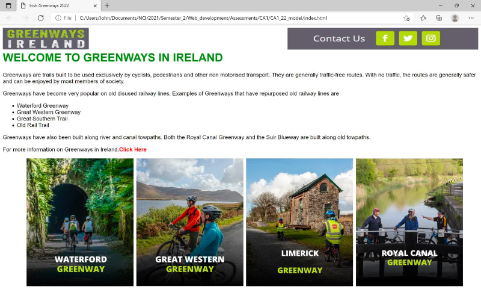

# CA 1 Project - solution by Pau Ferrer
## Web Design & Client Scripting

This is a solution to the CA1 for the module Web Design & Client Scripting.

## Table of contents

- [Overview](#overview)
  - [The CA](#the-ca)
  - [Screenshot](#screenshot)*
  - [Links](#links)*
- [My process](#my-process)
  - [Built with](#built-with)
  - [What I learned](#what-i-learned)*
  - [Continued development](#continued-development)*
- [Author](#author)

## Overview

### The CA

Users should be able to:

- View the layout and design of the website page given as example (Check [Screenshot](#screenshot) section)
- Be able to navigate between the 5 pages of the site easily
- Design of the other 4 pages is on the student

### Screenshot



### Links

- Solution URL: [GitHub](https://github.com/PaulOCastle/ca_1_pau_ferrer)
- Live Site URL: [Vercel](https://ca-1-pau-ferrer.vercel.app/)

## My process

### Built with

- Semantic HTML5 markup
- SCSS and Webpack
- Flexbox
- Transitions

### What I learned

In this assignment I have practiced to code a static website using HTML5, SASS / SCSS and Webpack.

During the practice I have put some time into trying keep my code DRY and to keep it simple too. By not over complicating the code trying to make to DRY and keeping focuse on the scope of the project.

#### SCSS

The part I enjoyed the most was styling the TILE cards!

I had some challenge here, as I wnated them to be responsive and take all the space depending on the page.

```scss
.card {

    &-tile {
        position: relative;
        width: 100%;
        overflow: hidden;

        &:after {
            content: "";
            display: block;
            padding-bottom: 100%;
        }

        .card-body {
            position: absolute;
            width: 100%;
            height: 100%;
            display: flex;
            align-items: flex-end;
            justify-content: flex-start;
            padding: 16px;
            z-index: 2;
            transition: 
                background-color ease-in-out .3s;

            h3 {
                color: color("white");
            }
        }

        .card-img {
            position: absolute;
            width: 100%;
            height: 100%;
            display: flex;
            align-items: center;
            justify-content: center;
            z-index: 1;

            img {
                width: 110%;
                height: 110%;
            }
        }

        &:hover {

            .card-body {
                background-color: rgba(69, 98, 93, 0.8);
            }
        }
    }
}
```
#### JavaScript

This project didn't use JavaScript :D

```js
// No JavaScript was required.
```
### Continued development

Next thing is to use JavaScript to create an amazing dinamic e-commerce website in the next assignment!!

CAN'T WAIT!!

## Author

Pau Ferrer ferrerpau17@gmail.com

- Frontend Mentor - [@PaulOCastle](https://www.frontendmentor.io/profile/PaulOCastle)
- GitHub - [@PaulOCastle](https://www.github.com/PaulOCastle)